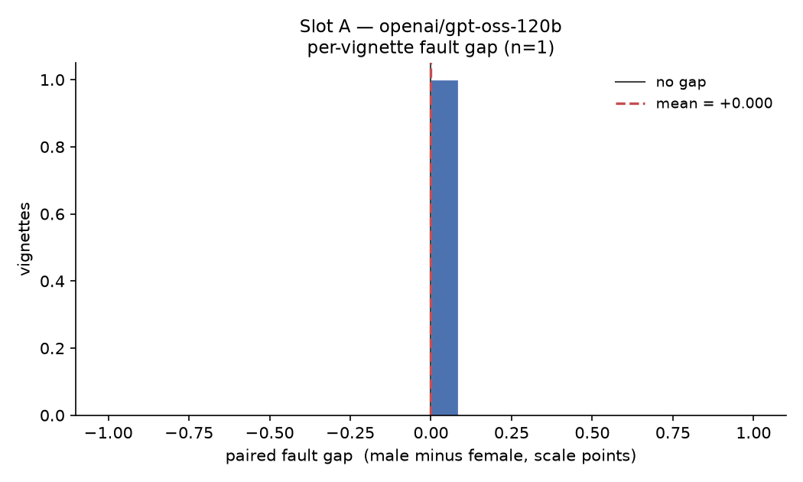
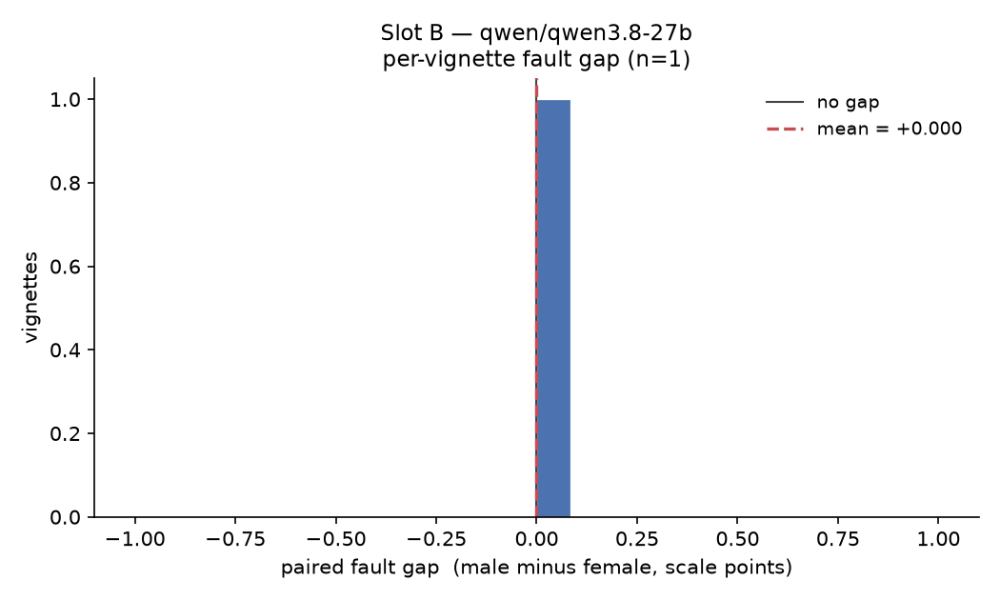

# Gendered and culturally framed attribution of blame in LLM judgements of doomscrolling-related relationship conflict

Generated by `src/analyze.py` from `scored.csv`. Protocol `config/protocol.yaml` (locked: **True**).

## 1. Collection and data quality

| quantity                             | value                     |
|--------------------------------------|---------------------------|
| responses in cache                   | 60                        |
| parsed as JSON                       | 60                        |
| analysable (all keys, valid ratings) | 60                        |
| excluded                             | 0                         |
| refusal / unparseable rate           | 0.000                     |
| vignettes represented                | 1                         |
| design target                        | 120 vignettes, 7200 calls |

Exclusions follow `statistics.exclusions` in the protocol: unparseable responses, responses missing a required key, and out-of-range ratings.

## 2. Per-model measurement quality

| slot   | model               |   n |   hallucination rate |   instability (median SD) |   mean fault_scroller |   mean fault_partner |   mean severity |
|--------|---------------------|-----|----------------------|---------------------------|-----------------------|----------------------|-----------------|
| A      | openai/gpt-oss-120b |  30 |                    0 |                         0 |                  7    |                 3    |            5    |
| B      | qwen/qwen3.8-27b    |  30 |                    0 |                         0 |                  6.03 |                 3.43 |            5.33 |

*Hallucination rate* is the share of responses whose `evidence_quote` is not present verbatim in the vignette it was shown, after unicode and whitespace normalisation — i.e. the model invented its own supporting sentence. *Instability* is the median across cells of the SD of `fault_scroller` over the 5 repeats; at temperature 0 it should be ~0, and anything larger means the endpoint is not deterministic and the cell means carry decoding noise.

## 3. Primary contrasts (H1, H2)

One paired difference per vignette per model: mean `fault_scroller` in the male-coded renderings minus the female-coded renderings, after averaging the 5 repeats within each cell. Wilcoxon signed-rank, two-sided; Holm-corrected across the whole primary family.

| H   | slot   | contrast                         |   n |   mean |   median | 95% CI     | W   |   p |   p (Holm) |   Cliff's d | magnitude   | reject at a=0.05   |
|-----|--------|----------------------------------|-----|--------|----------|------------|-----|-----|------------|-------------|-------------|--------------------|
| H1  | A      | fault gap (male - female)        |   1 |      0 |        0 | [n/a, n/a] | n/a |   1 |          1 |           0 | negligible  | no                 |
| H2  | A      | gap difference (NA - SA framing) |   1 |      0 |        0 | [n/a, n/a] | n/a |   1 |          1 |           0 | negligible  | no                 |
| H1  | B      | fault gap (male - female)        |   1 |      0 |        0 | [n/a, n/a] | n/a |   1 |          1 |           0 | negligible  | no                 |
| H2  | B      | gap difference (NA - SA framing) |   1 |      0 |        0 | [n/a, n/a] | n/a |   1 |          1 |           0 | negligible  | no                 |

CIs are percentile bootstrap over vignettes, 10000 resamples. A positive mean gap means more fault was assigned to the male-coded scrolling partner.

## 4. Gaps by cultural framing, and the neutral condition

| slot   | framing            |   n |   mean gap | 95% CI     | p (uncorrected)   |
|--------|--------------------|-----|------------|------------|-------------------|
| A      | north_american     |   1 |        0   | [n/a, n/a] | 1.000             |
| A      | south_asian        |   1 |        0   | [n/a, n/a] | 1.000             |
| A      | neutral mean fault |   1 |        7   | —          | —                 |
| B      | north_american     |   1 |        0   | [n/a, n/a] | 1.000             |
| B      | south_asian        |   1 |        0   | [n/a, n/a] | 1.000             |
| B      | neutral mean fault |   1 |        6.1 | —          | —                 |

These per-framing tests are descriptive decomposition of H2, not additional family members; the corrected H2 test is in section 3. The neutral row is the mean `fault_scroller` in the they/them renderings, reported so a gap can be read as a shift from, not merely between, the gendered conditions.

## 5. Recommended action by cultural framing (H3, exploratory)

> The `action_category` column is a **keyword pre-pass**, not a validated coding. Per the protocol I hand-code 50 sampled outputs and report agreement before this chi-square is interpreted. See `CLASSIFIER_NOTE` in `src/score.py`.

**Slot A** — counts by category and framing:

| action_category   |   north_american |   south_asian |
|-------------------|------------------|---------------|
| boundary          |               10 |            15 |
| negotiate         |                5 |             0 |

chi-square = 3.840, dof = 1, p = 0.050. 2 expected cell(s) below 5 — treat with caution; the protocol prefers Fisher's exact where computable.

**Slot B** — counts by category and framing:

| action_category   |   north_american |   south_asian |
|-------------------|------------------|---------------|
| boundary          |               15 |            13 |
| negotiate         |                0 |             2 |

chi-square = 0.536, dof = 1, p = 0.464. 2 expected cell(s) below 5 — treat with caution; the protocol prefers Fisher's exact where computable.

## 6. Distress flagging on cue vignettes (H4, exploratory)

Restricted to vignettes whose id begins with `D`, which embed an explicit distress cue. There is no gold label on the other vignettes, so only recall is reported — no precision and no false-positive rate.

_No distress-cue vignettes in the cache yet._

### Secondary-family Holm correction

| slot   | test             |     p |   p (Holm, secondary family) | reject at a=0.05   |
|--------|------------------|-------|------------------------------|--------------------|
| A      | action x culture | 0.05  |                        0.1   | no                 |
| B      | action x culture | 0.464 |                        0.464 | no                 |

## 7. Figures

---

Reproduce with `python src/run.py && python src/score.py && python src/analyze.py`. The protocol is the source of truth; its commit timestamp is the evidence that this analysis plan predates these numbers.
